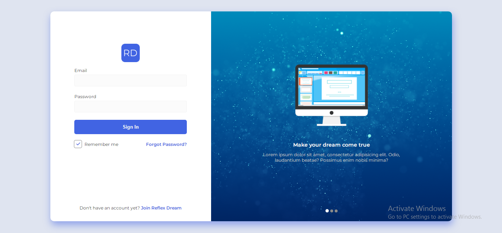

# Login Page
  
**By Jovan Novakovic**  
**Simple login page**
  
## Technology Used
- HTML
- CSS
- Font Awesome

## Description
Simple responsive login page made with HTML, CSS. Font Awesome library was used for icons.  
Reference and inspiration was taken by [Petras Nargela](https://dribbble.com/shots/9512973-Hire-Ground-Sign-In).

## Setup/Installation Requirements
- Clone this repository.
- Navigate to the top level of the directory.
- Open index.html in your browser.
  

## License and copyright 
Licensed under the [MIT License](LICENSE)
